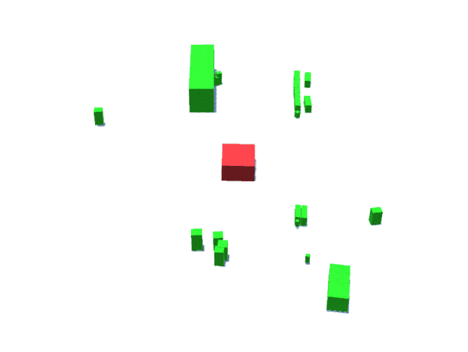

# Perception System - Autonomous Vehicles
An AI based PyTorch implementation of a Perception System.

## Description:
An AI Model capable of 3D Object detection is being being developed.Along with an UI for blind spot monitoring system from the AI prediction
Dataset used : https://www.nuscenes.org

## Camera View:

## Expected Output:

## Current Status:
The AI Model is under development
